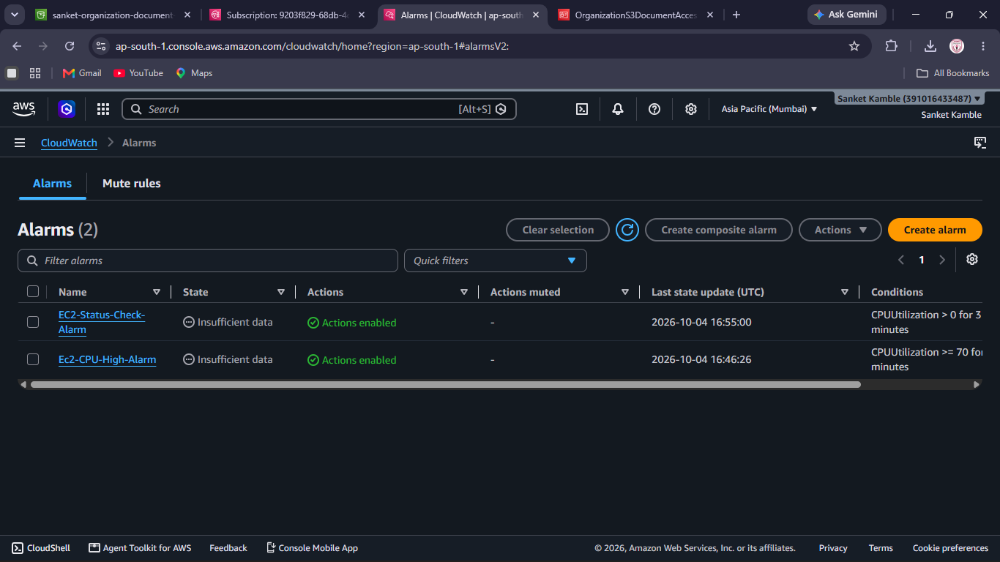
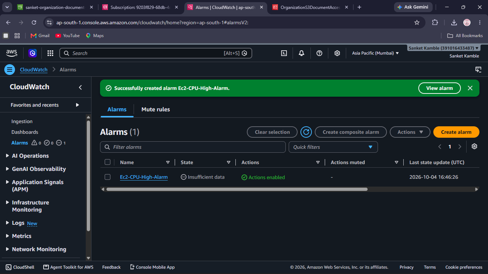
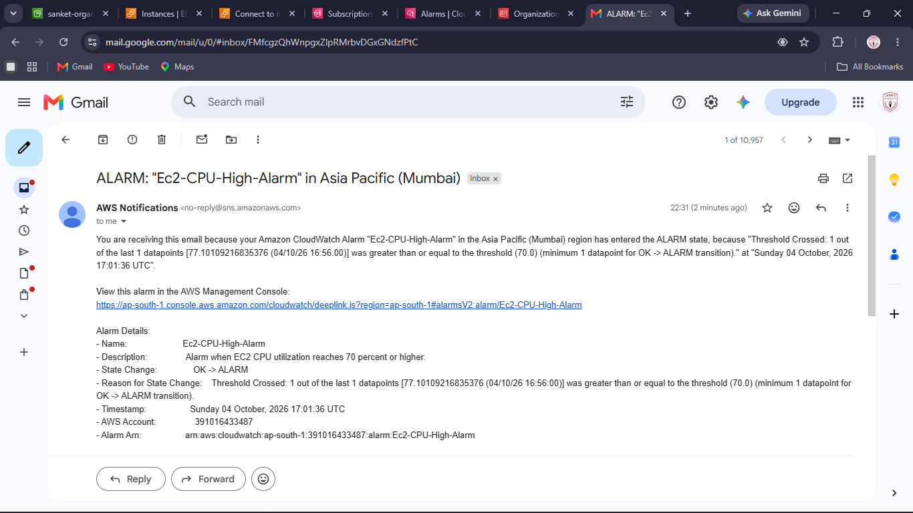
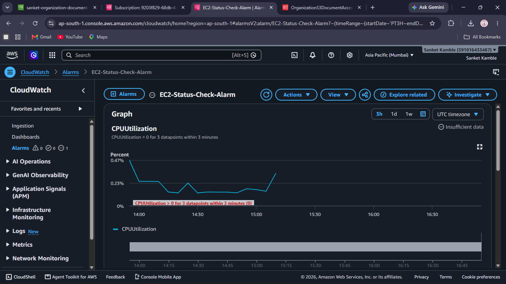
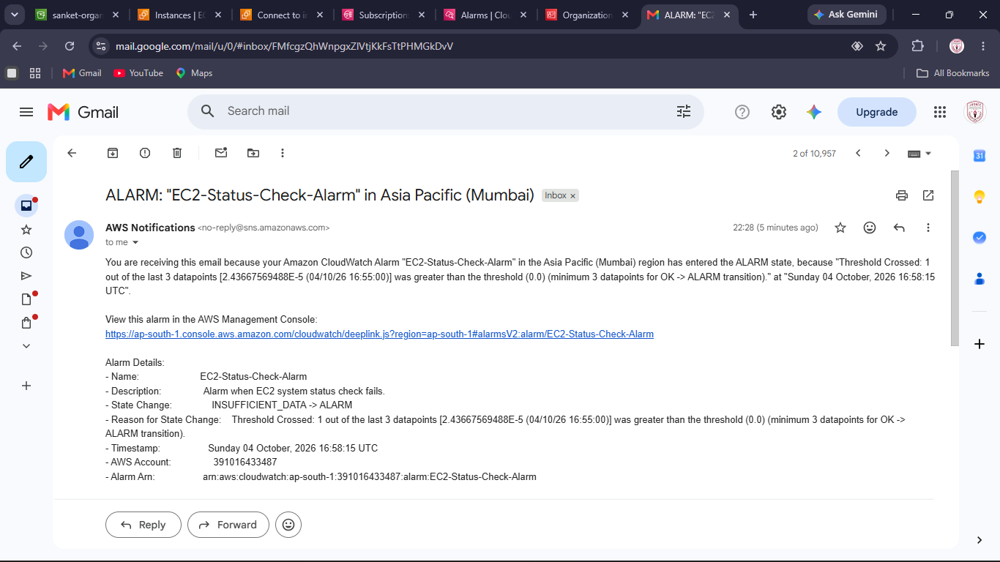
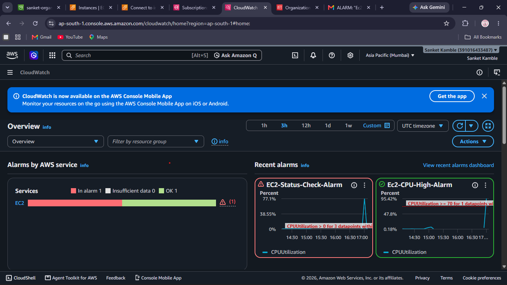
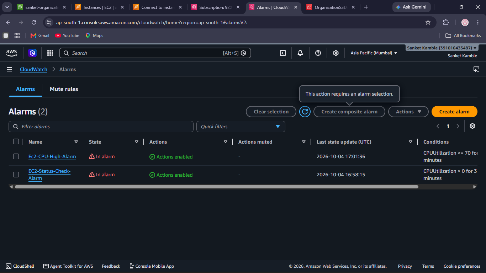

# AWS EC2 Monitoring Solution using CloudWatch and SNS

## AWS Project Assignment – Set 6 – Question 3

A monitoring solution for an Amazon EC2 web/application server using **Amazon CloudWatch** and **Amazon SNS**.

This project demonstrates EC2 CPU monitoring, CloudWatch alarms, SNS email notifications, alarm testing, and monitoring evidence.

---

## 1. Project Objective

The monitoring workflow is:

```text
Amazon EC2
     |
     v
Amazon CloudWatch
     |
     +-----------------------+
     |                       |
     v                       v
CPU Alarm              Alarm 2
     |                       |
     +-----------+-----------+
                 |
                 v
             SNS Topic
                 |
                 v
            Email Alert
```

The assignment requires monitoring for CPU utilization and instance status, at least two alarms, an SNS topic, and documentation of notifications generated during testing.

---

## 2. AWS Region

```text
Region: Asia Pacific (Mumbai)
Region Code: ap-south-1
```

---

## 3. CloudWatch Alarms

Two alarms are visible in the supplied evidence:

```text
EC2-CPU-High-Alarm
EC2-Status-Check-Alarm
```



---

## 4. CPU Utilization Alarm

Alarm name:

```text
EC2-CPU-High-Alarm
```

The supplied evidence shows the configured condition:

```text
CPUUtilization >= 70
```

The CPU alarm was tested by generating CPU load on the EC2 instance.



---

## 5. CPU Alarm Notification

During testing, `EC2-CPU-High-Alarm` entered the `ALARM` state.

The SNS email records:

```text
State Change: OK -> ALARM
```

and shows a CPU value above the configured threshold.



---

## 6. Second Alarm

A second CloudWatch alarm named:

```text
EC2-Status-Check-Alarm
```

was created and is visible in the CloudWatch evidence.



A corresponding AWS SNS notification email was received.



---

## 7. Important Evidence Note

The supplied screenshots and the notification for `EC2-Status-Check-Alarm` display **CPUUtilization** as the metric/condition, including a condition of:

```text
CPUUtilization > 0
```

Therefore, the supplied evidence proves that a second alarm with the name `EC2-Status-Check-Alarm` generated an SNS notification, but it does **not** visibly prove that the alarm uses an EC2 status-check metric.

For strict compliance with the assignment's instance-status requirement, verify or recreate the second alarm using an EC2 status-check metric such as:

```text
StatusCheckFailed
```

and capture a screenshot showing that metric.

This README intentionally distinguishes the visible evidence from configuration that is not visible in the supplied screenshots.

---

## 8. Alarm States

The supplied final evidence shows the alarms in the `ALARM` state.

```text
EC2-CPU-High-Alarm
EC2-Status-Check-Alarm
```


---

## 9. CloudWatch Monitoring Overview

The CloudWatch monitoring overview shows recent EC2 alarm activity and CPU utilization.



---

## 10. SNS Email Notifications

AWS SNS delivered email notifications for the alarm state changes.

The supplied emails contain:

- Alarm name
- State change
- Threshold information
- Timestamp
- AWS account information
- Alarm ARN

### Status Alarm Notification


### CPU Alarm Notification


---

## 11. CPU Alarm Testing Procedure

A CPU load test can be performed on the EC2 instance with:

```bash
stress --cpu 2 --timeout 300
```

Then observe:

```text
CloudWatch → Alarms → EC2-CPU-High-Alarm
```

The expected workflow is:

```text
CPU load increases
        ↓
CPUUtilization crosses threshold
        ↓
CloudWatch alarm = ALARM
        ↓
SNS action
        ↓
Email notification
```

---

## 12. Monitoring Architecture

```text
                      Amazon EC2
                          |
                          v
                  Amazon CloudWatch
                    /           \
                   /             \
          CPUUtilization       Alarm 2
                |                 |
                +--------+--------+
                         |
                         v
                    Amazon SNS
                         |
                         v
                  Email Notification
```

---

## 13. Evidence Screenshots

### CloudWatch Alarms


### CPU Alarm


### Status Check Alarm


### Alarms in ALARM State



### CloudWatch Overview


### SNS Notification – Status Alarm


### SNS Notification – CPU Alarm


---

## 14. Verification Results

| Requirement | Result |
|---|---|
| CloudWatch monitoring configured | PASS |
| CPU utilization monitoring | PASS |
| CPU alarm created | PASS |
| CPU alarm entered ALARM | PASS |
| SNS notification generated | PASS |
| SNS CPU email received | PASS |
| Second CloudWatch alarm created | PASS |
| Second alarm email received | PASS |
| Dedicated EC2 status-check metric visibly demonstrated | **Needs verification** |

---

## 15. Final Result

The project demonstrates an AWS monitoring workflow using CloudWatch and SNS:

```text
                 EC2
                  |
                  v
            CloudWatch
             /       \
            /         \
       CPU Alarm    Alarm 2
            \         /
             \       /
               SNS
                |
                v
               Email
```

The CPU monitoring alarm was successfully tested and an SNS email notification was received.

A second alarm named `EC2-Status-Check-Alarm` also generated an SNS notification. The supplied evidence, however, labels that alarm with CPUUtilization, so a fresh screenshot using an actual EC2 status-check metric should be added before final submission for strict compliance.

---

## Author

**Sanket Kamble**

```text
AWS | CloudWatch | SNS | EC2 | Monitoring
```
